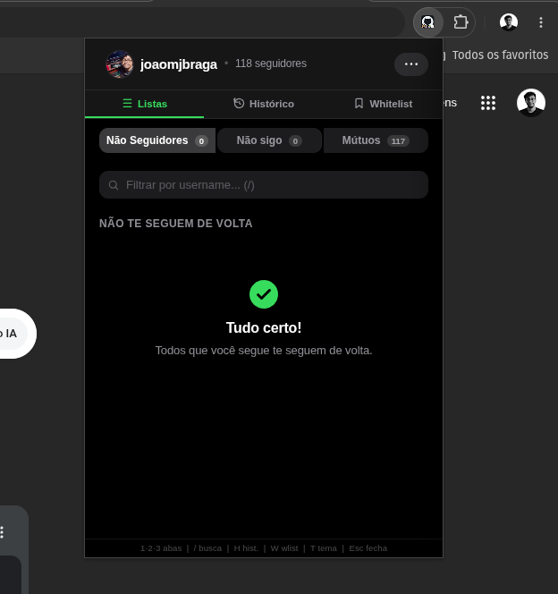

<div align="center">


[](https://chromewebstore.google.com/detail/github-unfollowers/lhjcplbgbldjcefdnlnjcogincpgdjjc)
[](https://developer.chrome.com/docs/extensions/mv3/intro/)
[](https://docs.github.com/en/rest)
[](LICENSE)

</div>

---

**GitHub Unfollowers** utiliza a API oficial do GitHub para analisar suas conexões — sem servidores de terceiros, sem coleta de dados. Tudo acontece localmente no seu navegador.

> Gerencie sua rede do GitHub sem sair do navegador.

---

## Funcionalidades

<table>
<tr>
<td width="50%">

### Listas e Análise

- Identifique quem não te segue de volta
- Veja quem te segue mas você não segue
- Visualize seguidores mútuos
- Comparativo histórico com badge "Novo"
- Detecção automática de perfis inacessíveis

</td>
<td width="50%">

### Ações e Controle

- Deixe de siga / Siga diretamente pela extensão
- Ações em massa com confirmação
- Retomada automática de ações interrompidas
- Whitelist de usuários ignorados
- Histórico de eventos (follow, unfollow, inacessível)
- Export/import de dados como JSON

</td>
</tr>
<tr>
<td>

### Interface

- Tema dark/light com alternância
- Busca por username em tempo real
- Links diretos para o perfil de cada usuário
- Badge no ícone com novos não-seguidores
- **Suporte a 16 idiomas com deteção automática**
- **Seletor de idioma com pesquisa**

</td>
<td>

### Técnico

- Cache local com Chrome Storage API
- Rate-limit awareness com retry automático
- Virtual scroll para listas grandes (50+)
- Atalhos de teclado e navegação por setas
- Acessibilidade com ARIA roles e focus trap

</td>
</tr>
</table>

---

## Demonstração



---

## Instalação

### Chrome Web Store (recomendado)

[**Instale agora na Chrome Web Store**](https://chromewebstore.google.com/detail/github-unfollowers/lhjcplbgbldjcefdnlnjcogincpgdjjc) — gratuito, sem necessidade de compilação.

### Instalação Manual

1. Clone o repositório:

   ```bash
   git clone https://github.com/joaomjbraga/github-unfollowers.git
   ```

2. Abra `chrome://extensions` no Chrome

3. Ative o **Modo do Desenvolvedor** (canto superior direito)

4. Clique em **Carregar sem compactação** e selecione a pasta do projeto

---

## Como Usar

1. Abra a extensão na barra de ferramentas do Chrome
2. Crie um token no GitHub com os escopos `read:user` + `user:follow`
3. Cole o token e clique em **Conectar**
4. Navegue pelas abas:

| Aba | Descrição |
| --- | --- |
| **Não Seguidores** | Você segue, mas não te seguem de volta |
| **Mútuos** | Seguidores que também você segue |
| **Não sigo** | Te seguem, mas você não segue de volta |

5. Use o campo de busca para filtrar por username
6. Clique em **Parar** para deixar de seguir ou **Seguir** para seguir de volta

### Atalhos de Teclado

| Tecla | Ação |
| --- | --- |
| `1` `2` `3` | Trocar entre abas |
| `/` | Focar no campo de busca |
| `H` | Aba Histórico |
| `W` | Aba Whitelist |
| `R` | Aba Listas |
| `T` | Alternar tema |
| `Esc` | Fechar painel / modal |

---

## Tecnologias

| Tecnologia | Finalidade |
| --- | --- |
| JavaScript (ES Modules) | Lógica principal — sem bundler, sem build |
| Chrome Extensions Manifest V3 | Service worker, popup, storage |
| GitHub REST API | Dados de seguidores e seguindo |
| Chrome Storage API | Persistência local de dados |

---

## Estrutura do Projeto

```
github-unfollowers/
├── popup.html              Interface HTML
├── popup.css               Estilos e tema dark/light
├── import.html             Página dedicada de importação (aba separada)
├── manifest.json           Configuração da extensão (MV3)
├── src/
│   ├── main.js             Bootstrap (importa app.js)
│   ├── app.js              Lógica principal, eventos, follow/unfollow
│   ├── api.js              GitHub REST API com retry, rate-limit, ETag cache
│   ├── ui.js               Renderização, histórico, whitelist, virtual scroll
│   ├── background.js       Service worker — detecta mudanças em segundo plano
│   ├── store.js            Estado global compartilhado
│   ├── storage.js          Wrapper tipado para chrome.storage.local
│   ├── cache.js            Cache ETag por página
│   ├── constants.js        Constantes compartilhadas
│   ├── dom.js              Helpers $() e $$()
│   ├── history.js          Histórico de eventos (30 dias)
│   ├── i18n.js             Internacionalização (16 idiomas)
│   ├── import.js           Lógica da página de importação
│   ├── theme.js            Gerenciamento de tema dark/light
│   ├── whitelist.js        Gerenciamento da whitelist
│   ├── utils.js            Funções utilitárias
│   └── dev.js              Mock de cenários de erro (dev)
└── icons/
    ├── icon16.png
    ├── icon48.png
    └── icon128.png
```

---

## Privacidade

O GitHub Unfollowers **não** coleta, armazena ou compartilha nenhum dado pessoal. Todos os dados são obtidos diretamente da API oficial do GitHub e processados localmente no seu navegador.

📄 [Política de Privacidade](https://joaomjbraga.github.io/github-unfollowers/privacy-policy)

---

## Contribuindo

Contribuições são bem-vindas!

1. Faça um fork do repositório
2. Crie um branch de funcionalidade (`git checkout -b feature/minha-funcionalidade`)
3. Faça commit usando [Conventional Commits](https://www.conventionalcommits.org/)
4. Envie para o seu fork (`git push origin feature/minha-funcionalidade`)
5. Abra um **Pull Request** contra o branch `main`

---

## Licença

Distribuído sob a [Licença MIT](LICENSE).

---

## Autor

**João M. J. Braga**

[](https://github.com/joaomjbraga)
[](https://www.linkedin.com/in/joaomjbraga)
