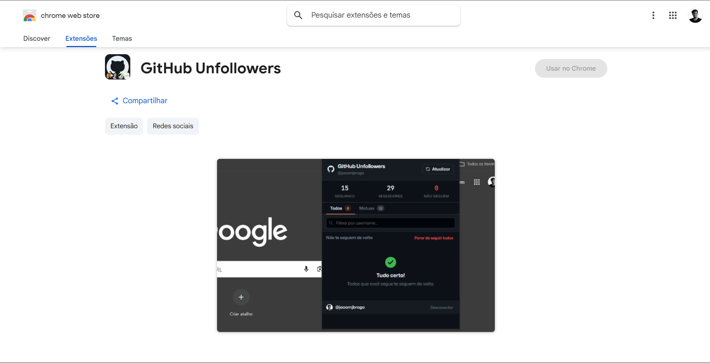

<div align="center">

# GitHub Unfollowers

**A Chrome extension to identify users you follow who don't follow you back.**

[](https://github.com/joaomjbraga/github-unfollowers)
[](https://developer.chrome.com/docs/extensions/mv3/intro/)
[](https://docs.github.com/en/rest)
[](LICENSE)



</div>

---

**GitHub Unfollowers** uses the official GitHub API to compare your followers and following lists, quickly surfacing accounts that don't follow you back. It's designed to be simple, fast, and browser-native — no third-party servers, no data collection.

> Manage your GitHub network without leaving your browser.

---

## Features

- 🔍 Identify users you follow who don't follow you back
- ⚡ Fast lookup via the GitHub REST API
- 🔗 Direct links to each user's profile
- ❌ Unfollow users directly from the extension
- 💾 Local data persistence with Chrome Storage API
- 🪶 Lightweight and intuitive interface

---

## Demo

> _Add screenshots or a GIF of the extension in action here._

---

## Installation

### Chrome Web Store

> 🚧 Coming soon.

### Manual Installation

1. **Clone the repository:**

```bash
git clone https://github.com/joaomjbraga/github-unfollowers.git
```

2. Open Chrome and navigate to:

```
chrome://extensions
```

3. Enable **Developer Mode** (toggle in the top-right corner).

4. Click **Load unpacked** and select the project folder.

---

## Usage

1. Open the extension from the Chrome toolbar.
2. Enter your GitHub credentials or personal access token when prompted.
3. Click **Search**.
4. Wait for the data to sync.
5. Review the list of users who don't follow you back.
6. Unfollow directly from the interface as needed.

---

## Tech Stack

| Technology                    | Purpose                 |
| ----------------------------- | ----------------------- |
| JavaScript                    | Core extension logic    |
| Chrome Extensions Manifest V3 | Extension architecture  |
| GitHub REST API               | Follower/following data |
| Chrome Storage API            | Local data persistence  |

---

## Project Structure

```
github-unfollowers/
├── icons/
│   ├── icon16.png
│   ├── icon48.png
│   └── icon128.png
├── popup.html
├── popup.js
├── manifest.json
└── README.md
```

---

## Privacy

GitHub Unfollowers does **not** collect, store, or share any personal data.

All data is fetched directly from the official GitHub API and processed locally in your browser. Nothing leaves your machine.

📄 [Privacy Policy](https://joaomjbraga.github.io/github-unfollowers/privacy-policy)

---

## Contributing

Contributions are welcome! To get started:

1. Fork the repository.
2. Create a feature branch:

```bash
git checkout -b feature/my-feature
```

3. Commit your changes using [Conventional Commits](https://www.conventionalcommits.org/):

```bash
git commit -m "feat: add new functionality"
```

4. Push to your fork:

```bash
git push origin feature/my-feature
```

5. Open a **Pull Request** against the `main` branch.

---

## License

Distributed under the [MIT License](LICENSE).

---

## Author

**João M. J. Braga**

[](https://github.com/joaomjbraga)
[](https://www.linkedin.com/in/joaomjbraga)
