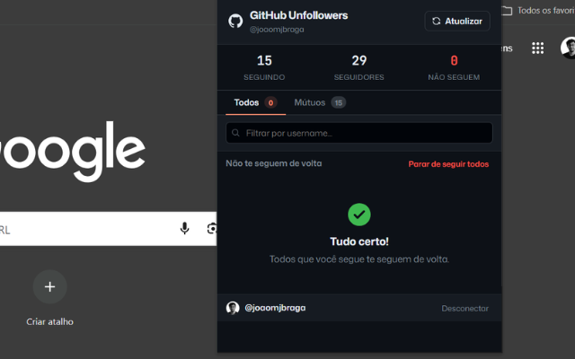

<div align="center">

# GitHub Unfollowers

**Versão 1.3.0**

**Uma extensão para Chrome que analisa sua rede no GitHub: descubra quem não te segue de volta, quem você não segue e seus seguidores mútuos.**

[](https://github.com/joaomjbraga/github-unfollowers)
[](https://developer.chrome.com/docs/extensions/mv3/intro/)
[](https://docs.github.com/en/rest)
[](LICENSE)


</div>

---

**GitHub Unfollowers** utiliza a API oficial do GitHub para analisar suas conexões: descubra quem não te segue de volta, quem você não segue e seus seguidores mútuos. Foi projetado para ser simples, rápido e nativo do navegador — sem servidores de terceiros, sem coleta de dados.

> Gerencie sua rede do GitHub sem sair do navegador.

---

## Funcionalidades

- 🔍 Identifique usuários que você segue mas não te seguem de volta
- 👥 Veja quem te segue mas você não segue de volta (follow back)
- 🤝 Visualize seguidores mútuos
- 🔔 Badge no ícone da extensão com total de novos não-seguidores
- 📊 Comparativo histórico com badge "Novo" nas listas
- ⚡ Consulta rápida através da REST API do GitHub
- 🔗 Links diretos para o perfil de cada usuário
- ❌ Deixe de seguir / ✅ Siga diretamente pela extensão
- 📋 Ações em massa (seguir todos / deixar de seguir todos)
- 🔄 Retomada automática de ações em massa com confirmação
- 🛡️ Whitelist de usuários ignorados
- 💾 Cache local com a Chrome Storage API
- 🌙 Tema dark/light com alternância
- ⌨️ Atalhos de teclado e navegação por setas nas abas
- ♿ Acessibilidade com ARIA roles e focus trap

---

## Demonstração



---

## Instalação

### Chrome Web Store

https://chromewebstore.google.com/detail/github-unfollowers/lhjcplbgbldjcefdnlnjcogincpgdjjc

### Instalação Manual

1. **Clone o repositório:**

```bash
git clone https://github.com/joaomjbraga/github-unfollowers.git
```

2. Abra o Chrome e navegue para:

```
chrome://extensions
```

3. Ative o **Modo do Desenvolvedor** (alternar no canto superior direito).

4. Clique em **Carregar sem compactação** e selecione a pasta do projeto.

---

## Como Usar

1. Abra a extensão na barra de ferramentas do Chrome.
2. Insira seu Personal Access Token do GitHub (escopo `read:user` e `user:follow`).
3. Clique em **Conectar**.
4. Navegue pelas abas:
   - **Não Seguidores** — você segue, mas não te seguem de volta
   - **Mútuos** — seguidores que também você segue
   - **Não sigo** — te seguem, mas você não segue de volta (siga de volta com um clique)
5. Use o campo de busca para filtrar por username.
6. Deixe de seguir ou siga diretamente pela interface conforme necessário.

---

## Tecnologias

| Tecnologia                    | Finalidade                   |
| ----------------------------- | ---------------------------- |
| JavaScript (ES Modules)       | Lógica principal da extensão |
| Chrome Extensions Manifest V3 | Arquitetura da extensão      |
| GitHub REST API               | Dados de seguidores/seguidos |
| Chrome Storage API            | Persistência local de dados  |

---

## Estrutura do Projeto

```
github-unfollowers/
├── popup.html              Interface HTML
├── popup.css               Estilos e tema dark/light
├── manifest.json           Configuração da extensão (MV3)
├── tsconfig.json           TypeScript checkJs para verificação de tipos
├── src/
│   ├── main.js             Bootstrap (importa app.js)
│   ├── app.js              Lógica principal, eventos, follow/unfollow
│   ├── ui.js               Renderização, histórico, whitelist, virtual scroll
│   ├── api.js              GitHub REST API com retry, rate-limit, ETag cache
│   ├── background.js       Service worker — detecta mudanças em segundo plano
│   ├── storage.js          Wrapper tipado para chrome.storage.local
│   ├── store.js            Estado global compartilhado
│   ├── cache.js            Cache ETag por página
│   ├── constants.js        Constantes compartilhadas (keys, timeouts, etc.)
│   ├── dom.js              Helpers $() e $$()
│   ├── history.js          Histórico de comparações (30 dias)
│   ├── theme.js            Gerenciamento de tema dark/light
│   ├── whitelist.js        Gerenciamento da whitelist
│   └── utils.js            Funções utilitárias (computeRelationshipLists, sleep)
├── icons/
│   ├── icon16.png
│   ├── icon48.png
│   └── icon128.png
├── CHANGELOG.md
└── README.md
```

---

## Privacidade

O GitHub Unfollowers **não** coleta, armazena ou compartilha nenhum dado pessoal.

Todos os dados são obtidos diretamente da API oficial do GitHub e processados localmente no seu navegador. Nada sai da sua máquina.

📄 [Política de Privacidade](https://joaomjbraga.github.io/github-unfollowers/privacy-policy)

---

## Contribuindo

Contribuições são bem-vindas! Para começar:

1. Faça um fork do repositório.
2. Crie um branch de funcionalidade:

```bash
git checkout -b feature/minha-funcionalidade
```

3. Faça commit das suas alterações usando [Conventional Commits](https://www.conventionalcommits.org/):

```bash
git commit -m "feat: adicionar nova funcionalidade"
```

4. Envie para o seu fork:

```bash
git push origin feature/minha-funcionalidade
```

5. Abra um **Pull Request** contra o branch `main`.

---

## Licença

Distribuído sob a [Licença MIT](LICENSE).

---

## Autor

**João M. J. Braga**

[](https://github.com/joaomjbraga)
[](https://www.linkedin.com/in/joaomjbraga)
